# chapter 3 advanced request-reply patterns
- how the request-reply mechanisms work
- how to combine REQ, REP, DEALER and ROUTER sockets
- how ROUTER sockets work, in detail
- the load balancing pattern
- building a simple load balancing message broker
- designing a high-level API for zmq
- building an asynchronous request-reply server
- a detailed inter-broker routing example

## the request-reply mechanisms
we already looked briefly at multipart messages. let's now look at a major use case, which is `reply message envelopes`. An envelop is a way of safely packaging up data with an address, without touching the data itself. by separating reply addresses into an envelop we make it possible to write general purpose intermediaries such as APIs and proxies that create, read and remove addresses no matter what the message payload or structure is.

in the request-reply pattern, the envelop holds the return address for replies. it is how a zmq network with no state can create round-trip request-reply dialogs.

when you use REQ and REP sockets you don't even see envelopes; these sockets deal with them automatically. but for most of the interesting request-reply patterns, you'll want to understand envelops and particularly ROUTER sockets. 

### the simple reply ENVELOPE
a request-reply exchange consists of a request message, and an eventual reply message. in the simple request-reply pattern, there's one reply for each request. in more advanced patterns, requests and replies can flow asynchronously. however, the reply envelope always works the same way.

the zmq reply envelop formally consists of zero or more reply addresses, followed by an empty frame(the envelop delimiter), followed by the message body(zero or more frames). the envelop is created by multiple sockets working together in a chain. we'll break this down.

we'll start by sending "hello" through a REQ socket. the REQ socket creates the simplest possible reply envelop, which has no addresses, just an empty delimiter frame and the message frame containing the "hello" string. this is a two frame message


the REP socket does the matching work: it strips off the envelop, up to and including the delimiter frame, saves the whole envelope, and passes the "hello" string up the application. thus our original hellow world example used request-reply envelopes internally, bu the application never saw them.

if you spy on the network data flowing between `hwclient` and `hwserver`, this is what you'll see: every request and every reply is in fact two frames, an empty frame and then the body. it doesn't seem to make much sense for a simple REQ-REP dialog. however you'll see the reason when we explore how ROUTER and DEALER handle envelopes;

### the extended reply envelope
let's extend the REQ-REP pair with a ROUTER-DEALER proxy in the middle and see how this affects the reply envelop. this is the extended request-reply pattern, we can in fact, insert any number of proxy steps the mechanics are the same

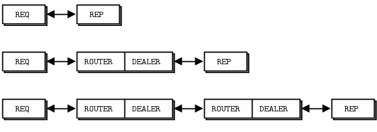

the proxy does this in pseudo-code:
```code
prepare context, frontend and backend sockets
while true:
    poll on both sockets
    if frontend had input:
        read all frames from frontend
        send to backend
    if backend had input:
        read all frames from backend
        send to frontend
```

the ROUTER socket, unlike other sockets, tracks every connection it has, and tells the caller about these. the way it tells the caller is to stick the connection identity in front of each message received. an identity, sometimes called an address, is just a binary string with no meaning except "this is a unique handle to the connection". then when you send a message via a ROUTER socket, you first send an identity frame.

the `zmq_socket()` man page describe it thus:
>when receiving messages a ZMQ_ROUTER socket shall prepend a message part containing the identity of the originating peer to the message before passing it to the application. messages received are fair-queued from among all connected peers. when sending messages a ZMQ_ROUTER socket shall remove the first part of the message and use it to determine the identity of the peer the message shall be routed to.

as a historical note, zmq v2.2 and earlier use UUIDs as identities. zmq v3.0+ generate a 5 byte identity by default(0+a random 32bit integer). there's some impact on network performance, but only when you use multiple proxy hops, which is rare. mostly the change was to simplify building libzmq by removing the dependency on a UUID lib.

Identities are a difficult concept to understand, but it's essential if you want to become a zmq expert. the ROUTER socket create a random identity for each connection with which it works. if there are three REQ sockets connected to a ROUTER socket, it will create tree random identities, one for each REQ socket.

so if we continue our worked example, let's say the REQ socket has a 3-byte identity ABC. internally, this means the ROUTER socket keeps a hash table where it can search for ABC to find the TCP connection for the REQ socket.

when we receive the message off the ROUTER socket, we get three frames


the core of the proxy loop is "read from one socket, write to the other", so we literally send these three frames out on the DEALER socket. if you now sniffed the network traffic, you would see these three frames flying from the DEALER socket to the REP socket. the REP socket does as before, strips off the whole envelop including the new reply address, and once again delivers the "hello" to the caller.

incidentally the REP socket can only deal with one request-reply exchange at a time, which is why if you try to read multiple requests or send multiple replies without sticking to a strct recv-send cycle, it gives an error.

you should now be able to visualize the return path. when hwserver sends "world" back, the REP socket wraps that with the envelop it saved, and sends a three-frame reply message across the write to the DEALER socket.


now the DEALER reads these three frames, and sends all three out via the ROUTER socket. the Router takes the first frame for the message, which is ABC identity, and loos up the connection for this. if it finds that, it then pumps the next frames out onto the wire.


the REQ socket picks this message up, and checks that the first frame is the empty delimiter, which it is. the REQ socket discards that first frame and passes "world" to the calling application, which prints it out to the amazement of the younger us looking at zmq for the first time.


### what's this good for?
to be honest, the use cases for strict request-reply or extended request-reply are somewhat limited. for one thing, there's no easy way to recover from common failures like the server creashing due to buggy application code. <more in chapter 4>. however once you grasp the way these four sockets del with envelopes, and how they talk to each other, you can do very useful things. we saw how ROUTER uses the reply envelope to decide which client REQ socket to route a reply back to. now let's express this another way:
- each time ROUTER gives you a message, it tells you what peer that came from as an identity.
- you can use this with a hash table(with the identity as key) to track new peers as they arrive
- ROUTER will route messages asynchronously to any peer connected to it, if you prefix the identity as the first frame of the message.

ROUTER sockets don't care about the whole envelop. they don't know anything about the empty delimiter. all they care about is that one identity frame that lets them figure out which connection to send a message to.

### recap of request-reply sockets
- the REQ socket sends, to the network, an empty delimiter frame in front of the message data. REQ sockets are synchronous. REQ sockets always send one request and then wait for one reply. REQ sockets talk to one peer at a time. if you connect a REQ socket to multiple peers, requests are distributed to and replies expected from each peer one turn at a time.
- the REP socket reads and saves all identity frames up to and including the empty delimiter, then passes the following frame or frames to the caller. REP sockets are synchronous and talk to one peer at a time. if you connect a REP socket to multiple peers, requests are read from peers in fair fashion, and replies are always sent to the same peer that made the last request.
- the DEALER socket is oblivious to the reply envelope and handles this like any multipart message. DEALER sockets are asynchronous and like PUSH and PULL combined. they distribute sent messages among all connections, and fair-queue received messages from all connections.
- The ROUTER socket is oblivious to the reply envelop, like DEALER. it creates identities for its connections, and passes these identities to the caller as a first frame in any received message. conversely, when the caller sends a message, it uses the first message frame as an identity to loop up the connection to send to. ROUTER are asynchronous.


## Request-Reply Combinations
we have four request-reply sockets, each with a certain behavior. we've seen how they connect in simple and extended request-reply patterns. but these sockets are building blocks that you can use to solve many problems.

### the legal combinations
- REQ    -> REP
- DEALER -> REP
- REQ    -> ROUTER
- DEALER -> ROUTER
- DEALER -> DEALER
- ROUTER -> ROUTER

### invalid combinations
- REQ -> REQ
- REQ -> DEALER
- REP -> REP
- REP -> ROUTER

here are some tips for remembering the semantics. DEALER is like an asynchronous REQ socket, and ROUTER is like an asynchronous REP socket. where we use a REQ socket, we can use a DEALER; we just have to read and write the envelope ourselves. where we use a REP socket, we can stick a ROUTER; we just need to manage the identities ourselves.

think of REQ and DEALER sockets as "Clients" and REP and ROUTER sockets as "servers".  mostly, you'll want to bind REP and ROUTER sockets, and connect REQ and DEALER sockets to them.
**bind server, connect to client**
it's not always going to be this simple, but it is a clean and memorable place to start.

## REQ and REP combination
the REQ client MUST initiate the message flow. a REP server cannot talk to a REQ client that hasn't first sent it a request. technically, it's not even possible, and the API also returns an EFSM error if you try it.

## DEALER and REP combination
let's replace the REQ client with a DEALER. this gives us an asynchronous client that can talk to multiple REP servers. if we rewrote the "Hello world" client using DEALER, we'd be able to send off any number of "Hello" requests without waiting for replies.

when we use a DEALER to talk to a REP socket, we MUST accurately emulate the envelope that the REQ socket would have sent, or the REP socket will discard the message as invalid. so to send a message, we: 
1. send an empty message frame with the MORE flag
2. send the message body.

and when we receive a message, we:
1. receive the first frame and if it's not empty, discard the whole message
2. receive the next frame and pass that to the application.

## the REQ and ROUTER combination
in the same way that we can replace REQ with DEALER, we can replace REP with ROUTER. this gives us an asynchronous server that can talk to multiple REQ clients at the same time. if we rewrote the "hello world" service using Router, we'd be able to process any number of "hello" reuests in parallel. 

we can use Router in two distinct ways:
- as a proxy that switches messages between frontend and backend sockets
- as an application that reads the message and acts on it.

in the first case, the ROUTER simply reads all frames, including the artificial identity frame, and passes them on blindly. in the second case the ROUTER must know the format of the reply envelop it's being sent. as the other peer is a REQ socket, the ROUTER gets the identity frame, an empty frame, and then the data frame.

## the DEALER to ROUTER combination
now we can switch out bother REQ and REP with DEALER and ROUTER to get the most powerful socket combination, which is DEALER talking to ROUTER. it gives us asynchronous clients talking to asynchronous servers, where both side have full control over the message formats.

because both DEALER and ROUTER can work with arbitrary message formats, if you hope to use these safely, you have to become a little bit of a protocol designer. at the very least you must decide whether you with to emulate the REQ/REP reply envelop. it depends on whether you actually need to send replies or not.

## the ROUTER to ROUTER combination
this sounds perfect for N-to-N connections, but it's the most difficult combination to use. you should avoid it untill well advanced.


## Invalid Combinations
### REQ to REQ
both side want to start by sending messages to each other, and this could only work if you timed thins so that both peers exchanged messages at the same time. it hurts my brain to even think about it.

### REQ to DEALER
you could in theory do this, but it would break if you added a second REQ because DELER has no way of sending a reply to the original peer. thus the REQ socket would get confused, and/or return messages meant for another client.

### REP to REP
both side would wait for the other to send the first message

### REP to ROUTER
the ROUTER socket can in theory initiate the dialog and send a properly-formatted request, if it knows the REP socket has connected and it knows the identity of that connection. it's messy and adds nothing over DEALER to ROUTER

the common thread in this valid versus invalid breakdown is that a zmq socket connection is always biased towards one peer that binds to an endpoint, and another that connects to that. further, that which side binds and which side connects is not arbitrary, but follows natural patterns. the side which we expected to be there binds: it'll be a server, a broker, a publisher, a collector. the side that comes and goes "connects": it'll be clients and workers. remembering this will help you design better zmq architectures

## Exploring ROUTER Sockets
let's look at ROUTER sockets a little closer. we've already seen how they work by routing individual messages to specific connections. I'll explain in more detail how we identify those connections, and what a ROUTER socket does when it can't send a messge.


### Identities and Addresses

the identity concept in ZMQ refers specifically to ROUTER sockets and how they identify the connections they have to other sockets. more broadly, identities are used as addresses in the reply envelope. in most cases, the identity is arbitrary and local to the ROUTER socket: it's a lookup key in a hash table. independently, a peer can have an address that is physical(a network endpoint like "tcp://182.168.55.117:5670") or logical( a UUID or email address or other unique key).

An application that uses a ROUTER socket to talk to specific peers can convert a logical address to an identity if it has built the necessary hash table. Because ROUTER sockets only announce the identity of a connection( to a specific peer) when that peer sends a message, you can only really reply to a message, not spontaneously talk to a peer.

this is true even if you flip the rules and make the ROUTER connect to the peer rather than wait for the peer to connect to the ROUTER. however you can force the  ROUTER socket to use a logical address in place of its identity. the `zmq_setsockopt` reference page calls this setting the socket identity. it works as follows:

- the peer applications set the `ZMQ_IDENTITY` option of its peer socket(DEALER OR REQ) before binding or connecting
- usually the peer then connects to the already-bound ROUTER socket. but the ROUTER can also connect to the peer.
- at the connection time. the peer socket tells the router socket, "please use this identity for this connection".
- if the peer socket doen't say that, the router generates its usual arbitrary random identity for the connection.
- the ROUTER socket now provides this logical address to the application as a prefix identity frame for any messages coming in from the that peer.
- the ROUTER also expects the logical address as the prefix identity frame for any outgoing messages.

here is a simple example of two peers that connect to a ROUTER socket, one that imposes a logical address "PEER2"
`identity_check.php`

here is what the program prints:
>Here is what the program prints:

>----------------------------------------
>[005] 006B8B4567
>[000]
>[039] ROUTER uses a generated 5 byte identity
>----------------------------------------
>[005] PEER2
>[000]
>[038] ROUTER uses REQ's socket identity

### ROUTER Error handling
Router sockets do have a somewhat brutal way of dealing with messages they can't send anywhere: they drop them silently. it's an attitude that makes sense in working code, but it makes debugging hard. the "send identity as first frame" approach is tricky enough that we often get this wrong when we're learning, and the ROUTER's stony silence when we mess up isn't very constructive.

Since ZMQ v3.2, there's a socket option you can set to catch this error: `ZMQ_ROUTER_MANDATORY`. set that on the ROUTER socket and then when you provide an unroutable identity on a send call, the socket will signal an EHOSTUNREACH error.

## the Load Balancing pattern
Pattern: Router -> REQ -> DEALER

now let's look at some code, we'll see how to connect a ROUTER socket to a REQ socket, and then to a DEALER socket. these two examples follow the same logic, which is a **load balancing** pattern. this pattern is our first exposure to using the ROUTER socket for deliberate routing, ranther than simply acting as a reply channel.

the load balancing pattern is very common and we'll see it several times in this book. it solves the main problem with simple round robin routing (as PUSH and DEALER offer) which is that round robin becomes inefficient if tasks do not all roughly take the same time.

>"Round Robin" 是一种调度算法，通常用于多任务处理或资源分配。在这种算法中，任务或进程被依次分配时间片，每个任务都有相等的机会在一定时间内执行。当一个任务的时间片用尽时，系统将切换到下一个任务，以此类推。这个过程不断重复，直到所有任务完成或资源分配完成。

>这种调度算法的好处是公平性，因为每个任务都有平等的机会执行，而不会因为某个任务占用太多时间而导致其他任务被忽视。但是，Round Robin 调度算法可能会导致一些任务的响应时间较长，因为它们必须等待它们的时间片到来才能执行。

>总之，Round Robin 是一种常用于操作系统和计算机网络中的调度算法，用于有效地管理多任务和资源分配。

it's the post office analogy. if you have one queue per counter, and you have some people buying stamps(a fast, simple transaction), and some people opening new accounts(a very slow transaction), then you will find stamp buyers getting unfairly stuck in queues. just as in a post office, if your messaging architecture is unfair, people will get annoyed.

the solution in the post office is **to create a single queue so that even if one or two counters get stuck with slow working, other counter will continue to  serve clients on a first-come, first-serve basis.**

one reason PUSH and DEALER use the simplistic approach is sheer performance. if you arrive in any major US airport, you'll find long queues of people waiting at immigration. the border patrol officials will send people in advance to queue up at each counter, rather than using a single queue. having people walk fifty yards in advance saves a minute or two per passenger. and because every passport check takes roughly the same time, it's more or less fair. this is the strategy for PUSH and DEALER: **send work loads ahead of time so that there is less travel distance.**

this is a recurring theme with zmq: the world's problems are diverse and you can benefit from solving different problems each in the right way. the airport isn't the post office and one size fits no one, really well. 

let's return to the scenario of a worker(DEALER or REQ) connected to a broker(ROUTER). the broker has to know when the worker is ready, and keep a list of workers so that it can take the least recently used worker each time.

the solution is really simple, in fact: workers send a "ready" message when they start, and after they finish each task. the broker reads these messages one-by-one. each time it reads a message, it is from the last used worker. and because we're using a ROUTER socket, we get an identity that we can then use to send a task back to the worker.

it's a twist on request-reply because the task is sent with the reply, and any response for the task is sent as a new request. the following code examples should make ti clearer.

`router-to-req.php`

the `router-to-req.php` runs for five seconds and then each worker prints how many tasks they handled. if the routing worked, we'd expect a fair distribution of work:
```text
processed 8 tasks
processed 13 tasks
processed 11 tasks
processed 7 tasks
processed 9 tasks
processed 10 tasks
processed 10 tasks
processed 8 tasks
processed 14 tasks
processed 10 tasks
```

to talk to the workers in this example, we have to request a REQ-friendly envelop consisting of an identity plus an empty envelope delimiter frame.


## ROUTER Broker and DEALER Workers
anywhere you can use REQ, you can use DEALER, there are two specific difference:
- the REQ socket always sends an empty delimiter frame before any data frames; the DEALER does not.
- the REQ socket will send only one message before it receives a reply; the DEALER is fully asynchronous.

the synchronous versus asynchronous behavior has no effect on our example because we're doing strict request-reply. it is more relevant when we address recovering from failures which we'll come to in C4-reliable request-reply patterns

now let's look at exactly the same example but with REQ socket replaced by a DEALER socket;

`router-to-dealer.php`

the code is almost identical except that the worker uses a DEALER socket, and reads and writes that empty frame before the data frame. this is the approach I use when I want to keep compatibility with REQ workers

however, remember the reason for that empty delimiter frame: it's to allow multihop extended requests that terminate in a REP socket, which uses that delimiter to split off the reply envelope so it can hand the data frames to its application.

if we never need to pass the message along to a REP socket, we can simply drop the empty delimiter frame at both side, which makes things simpler. this is usually the design I sue for pur DEALER to ROUTER protocols.


## a Load Balancing message broker

the previous example is half-complete. it can manage a set of workers with dummy requests and replies, but it has no way to talk to clients. if we add a second frontend ROUTER socket that accepts client requests, and turn our example into a proxy that can switch messages from frontend to backend, we get a useful and reusable tiny load balancing message broker.


this broker does the following:
- accepts connections from a set of clients
- accepts connections from a set of workers
- accepts requests from clients and holds these in a single queue.
- sends these requests to workers using the load balancing pattern
- receives replies back from workers
- sends these replies back to the original requesting client.

the broker code is fairly long, but worth understanding

`load-balancing-broker-router-to-router.php`
the difficult part of this program is 
1. the envelopes that each socket reads and writes
2. the load balancing algorithm.

we'll take these in turn, starting with the message envelope formats.

let's walk through a full request-reply chain from client to worker and back. in this code we set the identity of client and worker sockets to make it easier to trace the message frames. in reality, we'd allow the ROUTER sockets to invent identities for connections. let's assume the client's identity is "CLIENT" and worker's identity is "WORKER". the client application sends a single frame containing "hello"


Because the REQ socket adds its empty delimiter frame and the ROUTER socket adds its connection identity, the proxy reads off the frontend ROUTER socket tthe client address, empty delimiter frame, and the data part.


the broker sends this to the worker, prefixed by the address of the chosen worker, plus an additional empty part to keep the REQ at the other end happy.


this complex envelop stack gets chewed up first by the backend ROUTER socket, which removes the first frame. then the REQ socket in the worker removes the empty part, and provides the rest to the worker application.


the worker has to save the envelope(which is all the parts up to and including the empty message frame) and then it can do what's needed withthe data part. note that the REP socket would do this automatically, but we're using the REQ-ROUTER pattern so that we can get proper load balancing.

on the return path, the messages are the same as then they come in. i.e., the backend socket gives the broker a message in five parts, and the broker sends the frontend socket a message in three parts, and the client gets a message in one part.


now let's look at the load balancing algorithm. it requires that both clients and workers use REQ sockets, and that workers correctly store and reply the envelop on messages they get. the algorithm is:
- create a pollset that always polls the backend, and polls the frontend only if there are one ore more workers available
- poll for activity with infinite timeout
- if there is activity on the backend, we either have a "ready" message or a reply for a client. in either case, we store the worker address(the first part) on our worker queue, and if the rest is a client reply, we send it back to that client via the frontend.
- if there is activity on the frontend, we take the client request, pop the next worker(which is the last used), and send the request to the backend. t his means sending the worker address, empty apart, and then the three parts of the client request.

you should now see that you can reuse and extend the load balancing algorithm with variations based on the information the worker provides in its initial "ready" message. for example, workers might start up and do a performance self test, then tell the broker how fast they are. the broker can then choose the fastest available worker rather than the oldest.


## A High-Level API for zmq
we're going to push request-reply onto the stack and open a different area, which is the zmq API itself. there's a reason for this detour: as we write more complex examples, the low-level zmq API starts to look increasingly clumsy. look at the core of the worker tread from our load balancing broker

```c
while(true) {
    // get one address frame and empty delimiter
    char *address = s_recv(worker);
    char *empty = s_recv(worker);
    assert(*empty == 0);
    free(empty);

    // get request, send reply
    char *request = s_recv(worker);
    printf("worker: %s\n", request);
    free(request)

    s_sendmore(worker, address);
    s_sendmore(worker, "");
    s_send(worker, "ok");
    free(address);
}
```
that code isn't even reusable because it can only handle one reply address in the envelope, and it already does some wrapping around the zmq API, if we used the libzmq simple message API this is what we'd have to write

```c
while(true) {
    // get one address frame and empty delimiter
    char address [255];
    int address_size = zmq_recv(worker, address, 255, 0);
    if(address_size == -1)
        break;

    char empty[1];
    int empty_size = zmq_recv(worker, empty, 1, 0);
    assert(empty_size <=0);
    if(empty_size == -1)
        break;

    // get request, send reply
    char request [256];
    int request_size = zmq_recv(worker, request, 255, 0);
    if (request_size == -1)
        return NULL;
    request [request_size] = 0;
    printf("worker: %s\n", request);

    zmq_send(worker, address, address_size, ZMQ_SNDMORE);
    zmq_send(worker, emtpy, 0, ZMQ_SNDMORE);
    zmq_send(worker, "OK", 2, 0);
}
```
and when code is too long to write quickly, it's also too long to understand. up until now, i've stuck the native API because, as zmq users, we need to know that intimately. but when it gets in our way, we have to treat it as a problem to solve.

we can't of course just change the zmq API, which is a documented public contract on which thousands of people agree and depend. instead, we construct a higher-level API on top based on our experience so far, and most specifically, our experience from writing more complex request-reply patterns.

making a good message API is fairly difficult. we have a problem of terminology: zmq uses "message" to describe both multipart messages, and individual message frames. we have a problem of expectations: sometimes it's natural to see message content as printable string data, sometimes as binary blobs. and we have technical challenges, especially if we want to avoid copying data around too much.

the challenge of making a good API affects all languages, though my specific use case is C. whatever language you use, think about how you could contribute to your language binding to make it as good(or better) than the C binding I'm going to describe.

### Features of a Higher-Level API
my solution is to use three fairly natural and obvious concepts: string(already the basis for our s_send and s_recv) helpers, frame(a message frame) and message(a list of one or more frames)

```c
while(true) {
    zmsg_t *msg = zmsg_recv(worker);
    zframe_rest (zmsg_last (msg), "ok", 2);
    zmsg_send($msg, worker);
}
```

cutting the amount of code we need to read and write complex messages is great: the results are easy to read and understand. let's continue this process for other aspects of working zith zmq. here's a wish list of things i'd like in a higher-level API, based on my experience with zmq so far:
- automatic handling of sockets. I find it cumbersome to have to close sockets manually, and to have to explicitly define the linger timeout in some(but not all) cases. it'd be great to have a way to close sockets automatically when I close the context.
- Piping from parent to child treads. it's a recurrent problem: how to signal between parent and child threads. our API should provide a zmq message pipe(using PAIR sockets and inproc automatically)
- Portable clocks. even getting the time to a millisecond resolution, or sleeping for some milliseconds, is not portable. realistic zmq applications need portable clocks,so our API should provide them.
- a reactor to replace zmq_poll(). the poll loop is simple, but clumsy. writing a lot of these, we end up dloing the same work over and over: calculating timers, and calling code when sockets are ready, a simple reactor with socket readers and timers would save a lot of repeated work.
- Proper handling of Ctrl-C. we already saw how to catch an interrupt. it would be useful if this happened in all applications.

### the CZMQ high-level API
turning this wish list into reality for the C gives use CZMQ, a zmq language binding for C. this high-level binding, in fact, developed out of earlier versions of the examples. it combines nicer semantics for working with zmq with some protability layers, and (importantly for c, but lesss for other languages) containers like hashes and lists. CZMQ also uses an elegant object model that leads to frankly lovely code.

here is the load balancing broker rewritten to use a hight-level API

`load-balancing-broker-using-high-level-api.php`

one thing CZMQ provides is clean interrupt handling. this means that Ctrl-C will cause any blocking zmq call to exit with a return code -1 and errno set to EINTR. the high-level recv methods will return NULL in such cases. so you can cleanly exit a loop like this:

```c
while(true){
    zstr_send(client, "hello");
    char *reply = zstr_recv(client);

    if(!reply)
        break;
    printf("client%s\n", reply);
    free(reply)
    sleep(1);
}
```
or if you're calling zmq_poll(), test on the return code:

```c
if (zmq_poll(items, 2, 1000*1000) == -1)
    break; //interrupted
```

the previous examples still uses `zmq_poll`. so how about reactors? the CZMQ z loop reactor is simple but functional it lets you:
- set a reader on any socket, i.e., code that is called whenever the socket has input
- cancel a reader on a socket
- set a timer that goes off once or multiple times at specific intervals
- cancel a timer.

zloop uses `zmq_poll()` internally. it rebuilds its poll set each time you add or remove readers, and it calculates the poll timeout to match the next timer. then, it calls the reader and timer handlers for each socket and timer that need attention.

when we use a reactor pattern, our code turns inside out. the main logic looks like this:
```c
zloop_t *reactor = zloop_new();
zloop_reader(reactor, self->backend, s_handle_backend, self);
zloop_start(reactor);
zloop_destroy($reactor);
```

the actual handling of messages sits inside dedicated functions or methods. you may not like the style-it's a matter of taste. what it does help with is mixing timers and socket activity. in the rest of this text, we'll use `zmq_poll()` in simpler cases, and zloop in more complex examples.

`load-balancing-broker-using-zloop.php`

getting applications to properly shut down when you send them Ctrl-c can be tricky. if you use the zctx class it'll automatically set up signal handling, but your code still has to cooperate. you must break any loop if zmq_poll returns -1 or any of the zstr_recv, zframe_recv or zmsg_recv emthods return NULL. if you have nested loops, it can be useful to make the outer ones conditional on !zctx_interrupted.

if you're using child threads, they won't receive the interrupt. to tell them to shutdown, you can either:
- destroy the context, if they are sharing the same context, in which case any blocking calls they are waiting on will end with ETERM.
- send them shutdown messages, if they are using their own contexts, for this you'll need some socket plumbing.

## The Asynchronous Client/Server Pattern
in the ROUTER to DEALER example, we saw a 1-to-N use case where one server talks asynchronously to multiple workers. we can turn this upside down to get a very useful N-to-1 architecture where various clients talk to a single server, and do this asynchronously.

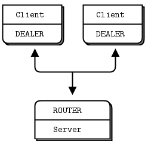

here is how it works:
- clients connect to the server and send requests
- for each request, the server send 0 or more replies
- clients can send multiple requests without waiting for a reply
- servers can send multiple replies without waiting for new requests

here's code that shows how this works

`asynchronous-Nclient-1server.php`

the example runs in one process, with multiple threads simulating a real multiprocess architecture. when you run the example, you'll see three clients(each with a random ID), printing out the replies they get from the server. look carefully and you'll see each client task gets 0 or more replies per request.

some comments on this code:
- the clients send a request once per second, and get zero or more replies back. to make this work using `zmq_poll()`, we can't simply poll with a 1-second timeout, or we'd end up sending a new reuqest onlly one second after we received the last reply. so we poll at a high frequency(100 times at 1/100th of a second per poll), which is approximately accurate.
- the server uses a pool of worker threads, each processing one request synchronlusly. it connects these to its frontend socket using an internal queue. it coonnects the frontend and backend sockets using a `zmq_proxy()` call.

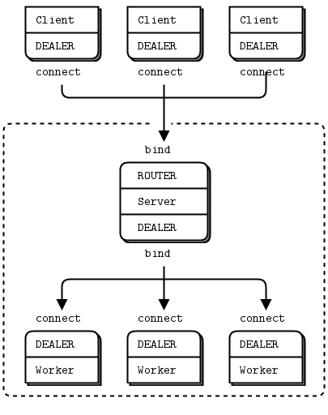

note that we're doing DEALER to ROUTER dialog between client and server, but internally between the server main thread and workers, we're doing DEALER to DEALER. if the workers were strictly synchronous. we'd use REP. however, because we want to send multiple replies, we need an async socket. we do not want to route replies, they always go to the single server thread that sent us the request.

let's think about the routing envelope. the client send a message consisting of a single frame. the server thread receives a two-frame message(original message prefixed by client identity). we send these two frames on to the worker, which treats it as a normal reply envelope, returns that to use as a two frame message. we then use the first frame as an identity to route the second frame back to the client as a reply.

it looks something like this:

     client          server       frontend       worker
   [ DEALER ]<---->[ ROUTER <----> DEALER <----> DEALER ]
             1 part         2 parts       2 parts

now for the sockets: we could use the load balancing ROUTER to DEALER pattern to talk to workers, but it's extra work. in this case, a DEALER to DEALER pattern is probably fine: the trade-off is lower latency for each request, but higher risk of unbalanced work distribution. simplicity wins in this case.

when you bind servers that maintain stateful conversations with clients, you will run into a classic problem. if the server keeps some state per client, and clients keep coming and going, eventually it will run out of resources. even if the same clients keep connecting, if you're using default identities, each connection will look like a new one.

we cheat in the above example by keeping state only for a very short time(the time it takes a worker to process a request) and then throwing away the state. but that's not practical for many cases. to properly manage client state in a stateful asynchronous server, you have to :
- do heart beating from client to server. in our example, we send a request once per second, which can reliably be used as a heartbeat
- store state using the client identity(whether generated or explicit) as key
- detect a stopped heartbeat. if there's no request from a client within, sya, two seconds, the server can detect this and destory any state it's holding for that client.

## worked example: inter-broker routing
let's take everything we've seen so far, and scale things up to a real application. we'll build this step-by-step over several iterations. our best client calls us urgently and asks for a design of a large cloud computing facility. he has this vision of a cloud that spans many data centers, each a cluster of clients and workers, and that works together as a whole. because we're smart enough to know  that practice always beats theory, we propose to make a working simulation using zmq. our client, eager to lock down the budget before hsi own boss changes his mind, and having read great things about zmq.

### establishing the details
several espressos later, we want to jump into writing code, but a little voice tells us to get more details before making a sensational solution to entirely the wrong problem. "what kind of work is the cloud doing?" we ask.

the client explains:
- workers run on various kinds of hardware, but they are all able to handle any task. there are several hundred workers per cluster, and as many as a dozen clusters in total.
- clients create tasks for workers. each task is na independent unit of work and all the client wants is to find an available worker, and sent it the task, as soon as possible. there will be a lot of clients and they'll come and go arbitrarily.
- the real difficulty is to be able to add and remove clusters at any time. a cluster can leave or join the cloud instantly, bringing all its workers and clients with it.
- if there are no workers in their own cluster, clients' task will go off to other available workers in the cloud.
- clients send out one task at a time, waiting for a reply. if they don't get an answer within X seconds, they'll just send out the task again. this isn't our concern; the client API does it already.
- workers process one task at a time; they are very simple beasts. if they crash, they get restarted by whatever script started them.

so we double-check to make sure that we understood this correctly:
- there will be some kind of super-duper network interconnect between clusters, right?", client answered "yes"
- what kind of volumes are we talking about? client replies: up to a thousand clients per cluster, each doing at most ten requests per second. requests are small, and replies are also small, no more than 1K bytes each

so we do a little calculation and see that this will work nicely over plain TCP. 2500 clients x 10/second x 10000 bytes x 2 directions = 50MB/Sec or 400Mb/sec, not a problem for a 1Gb network

it's a straightforward problem that requires no exotic hardware or protocols, just some clever routing algorithms and careful design. we start by designing one cluster(one data center) and then we figure out how to connect clusters together.

### architecture of a single cluster
workers and clients are synchronous. we want to use the load balancing pattern to route tasks to workers. workers are all identical; our facility has no notion of different services. workers are anonymous; clients never address them directly. we make no attempt here to provide guaranteed delivery, retry and so on.

for reasons we already examined, clients and workers won't speak to each other directly. it makes it impossible to add or remove nodes dynamically. so our basic model consists of the request-reply message broker we saw earlier.

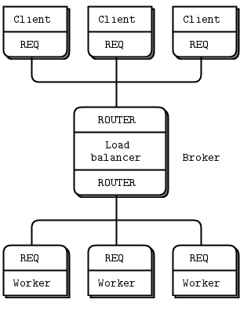

### scaling to multiple clusters
now we scale this out to more than one cluster. each cluster has a set of clients and workers, and a broker that joins these together.

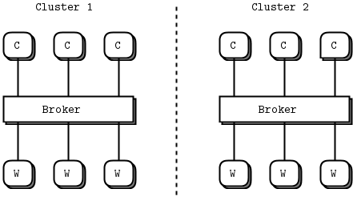

the question is: how do we get the clients of each cluster talking to the workers of the other cluster?
there are few possibilities, each with pros and cons:

- clients could connect directly to bother brokers. the advantage is that we don't need to modify brokers or workers. but clients get more complex and become aware of the overall topology. if we want to add a third or forth cluster, for example, all the clients are affected. in effect we have to move routing and failover logic into the clients and that's not nice.
- workers might connect directly to both brokers. but REQ workers can't do that, they can only reply to one broker. we might use REPs but REPs don't give us customizable broker-to-worker routing like load balancing does. only the built-in load balancing. that's a fail. if we want ot distribute work to idle workers, we precisely need load balancing. one solution would be to use ROUTER sockets for the worker nodes. let's label this 'Idea #1'
- brokers could connect to each other. this looks neatest because it creates the fewest additional connects. we can't add clusters to the fly, but that is probably out of scope. now clients and workers remain ignorant of the real network topology, and brokers tell each other when they have spare capacity. let's label this 'idea #2'

#### let's explore idea #1. 
in this model, we have workers connecting to bother borkers and accepting jobs from either one.

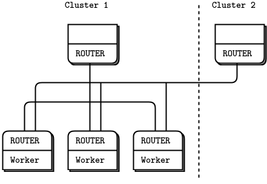


it looks feasible. however, it doesn't provide what we wanted, which was that clients get local workers if possible and remote workers only if it's better than waiting. also workers will signal "ready" to both brokers and can get two jobs at one, while other workers remain idle. it seems this design fails because again we're putting routing logic at the edges.

so, Idea #2 then, we interconnect the brokers and don't touch the clients or workers, which are REQs like we're used to.

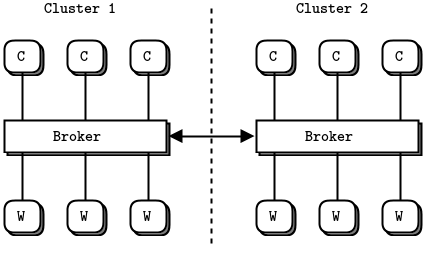

this design is appealing because the problem is solved in one place, invisible to the rest of the world. basically, brokers open secret channels to each other and whisper, like camel traders, "Hey, I've got some spare capacity. if you have too many clients, give me a shout and we'll deal".

in effect it is just a more sophisticated routing algorithm: brokers become subcontractors for each other. there are other things to like about this design, even before we play with real code:
- it treats the common case (clients and workers on the same cluster) as default and does extra work for the exceptional case(shuffling jobs between clusters).
- it lets us use different message flows for the different types of work. that means we can handle them differently, e.g., using different types of network connection
- it feels like it would scale smoothly. interconnecting three or more brokers doesn't get overly complex. if we find this to be a problem, it's easy to solve by adding a super-broker.

we'll now make a worked example. we'll pack an entire cluster into one process. that is obviously not realistic, but it makes it simple to simulate, and the simulation can accurately scale to real processes. this is the beauty of ZMQ - you can design at the micro-level and scale that up tot he macro-level. threads become processes, and then become boxes and the patterns and logic remain the same. each of our "cluster" processes contains client threads, worker threads and a broker thread.

we know the basic model well by now:

- the REQ client(REQ) threads create workloads and pass them to the broker(ROUTER)
- the REQ worker(REQ) threads process workload and return the results to the broker(ROUTER)
- the broker queues and distributes workloads using the load balancing pattern.

### Federation Versus Peering
there are several possible ways to interconnect brokers. what we want is to be able to tell other brokers "we have capacity", and then receive multiple tasks. we also need to be able to tell other brokers, "stop , we're full". It doesn't need to be perfect; sometimes we may accept jobs we can't process immediately, then we'll do them as soon as possible.


#### Federation
the simplest interconnect if **Federation**, in which brokers simulate clients and workers for each other. we would do this by connecting our frontend to the other broker's backend socket. note that it is legal to both bind a socket to an endpoint and connect it to other endpoints.

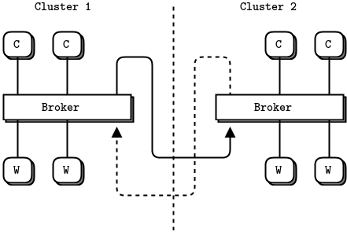

this would give us simple logic in both brokers and a reasonable good mechanism: when there are no workers, tell the other broker "ready", and accept one job from it. the problem is also that it is too simple for this problem. a federated broker would be able to handle only one task at a time. if the broker emulates a lock-stop client and worker, it is by definition also going to be lock-step, and if it has lots of available workers they won't be used. our brokers need to be connected in a fully asynchronous fashion.

the federation model is perfect for other kinds of routing, especially service-oriented architectures(SOAs), which route by service name and proximity rather than load balancing or round robin. so don't dismiss it as useless, it's just not right for all use cases.

#### Peering
instead of federation, let's look at a peering approach in which brokers are explicitly aware of each other and talk over privileged channels. let's break this down, assuming we want to interconnect N brokers. each broker has (N-1) peers, and all brokers are suing exactly the same code and logic. there are two distinct flows of information between brokers:
- each broker needs to tell its peer how many workers it has available at any time. this can be fairly simple information-just a quantity that is updated regularly. the obvious(and correct) socket pattern for this is pub-sub. so every broker opens a PUB socket and publish state information on that, and every broker also opens a SUB socket and connects that to the PUB socket of every other broker to get state information from its peers.
- each broker needs a way to delegate tasks to a peer and get replies back, asynchronously. we'll do this using R OUTER sockets; no other combination works. each broker has two such sockets: one for tasks it receives and one for tasks it delegates. if we didn't use two sockets, it would be more work to know whether we were reading  a request or a reply each time. that would mean adding more information to the message envelope.

and there is also the flow of information between a broker and its local clients and workers.

### the Naming Ceremony
Three flows X two sockets for each flow = six sockets that we have to manage in the broker. Choosing good names is vital to keeping a multi-socket juggling act reasonably coherent in our minds. Sockets do something and what they do should form the basis for their names. it's about being able to read the coe several weeks alter on a cold Monday morning before coffee, and not feel any pain. 

let's do a  shamanistic naming ceremony for the sockets. the three flows are:
- a local request-reply flow between the broker and its clients and works
- a cloud request-reply flow between the broker and its peer brokers
- a state flow between the broker and its peer broker.

finding meaningful names that are all the same length means our code will align nicely. it's not a big thing, but attention to details helps. for each flow the broker has two sockets that we can orthogonally call the frontend and backend. we've used these names quite often. a frontend receives information or tasks. a backend sends those out to other peers. the conceptual flow is from front to back (with replies going  in the opposite direction from back to front).

so in all the code we write for this tutorial, we will use these socket names:
- `localfe` and `localbe` for the local flow
- `cloudfe` and `cloudbe` for the cloud flow
- `statefe` and `statebe` for the state flow

for our transport and because we're simulating the whole thing on one box, we'll use `ipc` for everything. this has the advantage of working like tcp in terms of connectivity(i.e., it's a disconnected transport, unlike inproc), yet we don't need IP address ro DNS names, which would be a pain here. instead, we will use ipc endpoints called `something-local`, `something-cloud` and `something-state`, where something is the name of our simulated cluster.

you might be thinking that this is a lot of work for some names. why not call them s1, s2, s3, s4 etc? the answer is that if you brain is not a perfect machine, you need a lot help when reading code, and we'll see that these names do help. it's easier to remember "three flows, two directions than six different sockets"

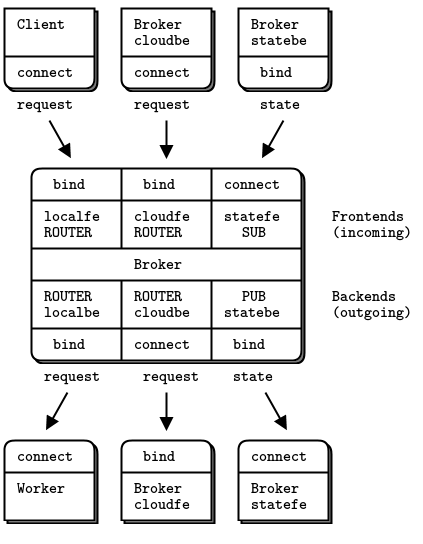

>NOTE what we connect the cloudbe in each broker to the cloudfe in every other broker, and likewise we connect the statebe in each broker to the statefe in every other broker

### prototyping the state flow

because each socket flow has its own little traps for the unwary, we will test them in real code one-by-one, rather than try to throw the whole lot into code in one go. when we're happy with each flow, we can put them together into a full program. we'll start with the state flow

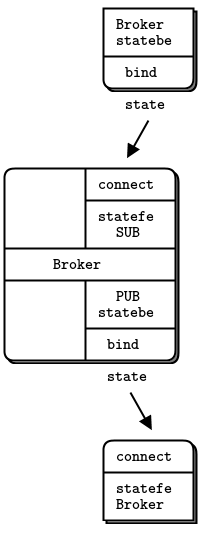

here is how this works in code: `prototype_state_flow.php`

>notes about this code
- each broker has an identity that we use to construct ipc endpoint names. A real broker would need to work with TCP and a more sophisticated configuration scheme. we'll look at such schemes later in this book, but for now, using generated ipc names lets us ignore the problem of where to get TCP/IP addresses or names.
- we use a `zmq_poll()` loop as the core of the program. this processes incoming messages and sends out state messages. we send a state message ONLY if we did NOT get any incoming messages and we waited for a second. if we send out a state message each time we get one in, we'll get message storms.
- we use a two-part pub-sub message consisting of sender address and data. Note that we will need to know the address of the publisher in order to send it tasks, and the only way is to send this explicitly as a part of the message.
- we don't set identities on subscribers because if we did then we'd get outdated state information when connecting to running brokers
- we don't set a HWM on the publisher, but if we were using ZMQ v2.x that would be a wise idea.

we can build this little program and run it three times to simulate three clusters. let's call them DC1, DC2 and DC3, we run these three commands, each in a separate window

```bash
# php prototype_state_flow.php DC1 DC2 DC3
I: preparing broker at DC1...
I: connecting to state backend at 'DC2' 
I: connecting to state backend at 'DC3' 
send random value for worker availability(5)
DC2 - 8 workers free
send random value for worker availability(5)
DC2 - 8 workers free
DC3 - 8 workers free
send random value for worker availability(8)
DC2 - 3 workers free
DC3 - 7 workers free
send random value for worker availability(2)


# php prototype_state_flow.php DC2 DC1 DC3
I: preparing broker at DC2...
I: connecting to state backend at 'DC1' 
I: connecting to state backend at 'DC3' 
DC1 - 5 workers free
send random value for worker availability(8)
send random value for worker availability(8)
DC1 - 5 workers free
DC3 - 8 workers free
send random value for worker availability(3)
DC1 - 8 workers free
DC3 - 7 workers free
send random value for worker availability(1)

# php prototype_state_flow.php DC3 DC1 DC2
I: preparing broker at DC3...
I: connecting to state backend at 'DC1' 
I: connecting to state backend at 'DC2' 
DC2 - 8 workers free
send random value for worker availability(8)
DC2 - 8 workers free
DC1 - 5 workers free
send random value for worker availability(7)
DC2 - 3 workers free
DC1 - 8 workers free
send random value for worker availability(10)
DC1 - 2 workers free
DC2 - 1 workers free
send random value for worker availability(3)

```

you'll see each cluster report the state of its peers, and after a few seconds they will all happily be printing random numbers once per second. try this and satisfy yourself that the three brokers all match up and synchronize to per-second state updates.

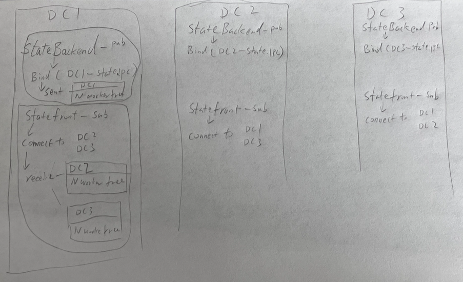


### Prototyping the local and cloud Flows
let's now prototype the flow of tasks via the local and cloud sockets. this code pulls requests from clients and then distributes them to local workers and cloud peers on a random basis.

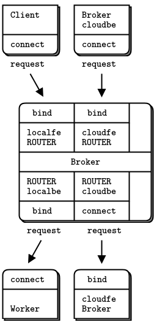

before we jump into the code, which is getting a little complex, let's sketch the core routing logic and break it down into a simple yet robust design.

we need two queues, one for requests from local clients and for requests from cloud clients. one option would be to pull messages off the local and cloud frontends, and pump these onto their respective queues. but this is kind of pointless because ZMQ sockets are queues already. so let's use the zmq socket buffers as queues.

this was the technique we used in the load balancing broker, and it worked nicely. we only read from the two frontends when there is somewhere to send the requests. we can always read from the backends, as they give us replies to route back. as long as the backends aren't talking to us, there's no point in even looking at the frontends.

so our main loop becomes:
- poll the backends fro activity. when we get a message, it may be "ready" from a worker or it may be a reply. if it's a reply, route back via the local or cloud frontend.
- if a worker replied, it became available, so we queue it and count it.
- while there are workers available, take a request, if any, from either frontend and route to a local worker, or randomly, to a cloud peer.

randomly sending tasks to a peer broker rather than a worker simulates work distribution across the cluster. it's dumb, but that is fine for this stage.

we use broker identities to route messages between brokers. each broker has a name that we provide on the command line in this simple prototype. as long as these names don't overlap with the zmq-generated UUIDs used for client nodes, we can figure out whether to route a reply back to a client or to a broker.

here is how this works in code. the interesting part starts around the comment "interesting part"

`prototype_local_cloud_flow.php`

run this by, for instance, starting two instances of the broker in two windows:
`php prototype_local_cloud_flow.php you me`
`php prototype_local_cloud_flow.php me you`

some comments on this code:
- in the C code at least, using the zmsg class makes life much easier, and our code much shorter. ti's obviously an abstraction that works. if you build zmq application in C, you should use CZMQ
- because we're not getting any state information from peers, we naively assume they are running. the code prompts you to confirm when you've started all the brokers. in the real case, we'd not send anything to brokers who had not told use they exist.

you can satisfy yourself that the code works by watching it run forever. if there were any mis-routed messages, clients would end up blocking, and the brokers would stop printing trace information. you can prove that by killing either of the brokers. the other broker tries to send requests to the cloud, and one-by-one its clients block, waiting for an answer.


### putting it all together
let's put this together into a single package. as before, we'll run an entire cluster as one process. we're going to take the two previous examples and merge them into one properly working design that lets you simulate any nbumber of cluster.

this code is the size of both previous prototypes together, at 270LoC. that's pretty good for a simulation of a cluster that includes clients and workers and cloud workload distribution.

`full-cluster-simulation.php`

it's nontrivial program and took about a day to get working. these are the highlights
- the client threads detect and repot a failed request. they do this by polling for a response and if noe arrives after a while(10 sec), print an error msg
- client threads don't print directly, but instead send a message to a monitor socket(PUSH) that the main loop collects(PULL) and prints off. this is the first case we've seen of using zmq socket for monitoring and logging; this is a big use case that we'll come back to later
- clients simulate varying loads to get the cluster 100% at random moments, so that tasks are shifted over to the coud. the number of clients and workers, and delays in the client and worker threads control this. feel free to play with them to see if you can make a more realistic simulation.
- the main loop uses two pollsets. it could in face use three: information, backends and frontends. as in the earlier prototype, there is no point in talking a frontend msg if there is no backend capacity

there are some of the problems that arose during developemnt of this program:
- clients would freeze, due to requests or replies geting lost somewhere. recall that the ROUTER socket drops messages it can't route. the first tractic there was to modify the client thread to detect and report such problems. secondly, i put `zmsg_dump()` calls after every receive and before every send in the main loop, until the origin of the problems was clear
- the main loop was mistakenly reading from more than one ready socket. this caused the first message to be lost. i fixed that by reading only from the frist ready socket
- the zmsg class was not properly encoding UUIDs as C strings. this caused UUIDs that contain 0 bytes to be corrupted. ifixed that by modifying zsmsg to encodue UUIDs as printable hex strings.

this simulation does not detect disappearance of a cloud peer. if you start several peers and stop one, and it was broadcasting capacity to the others, they will continue to send it work even if it's gone. you can try this, and you will get clients that complain of lost requests, the solution is twofold: first: only keep the capacity information for a short time so that if a peer does disappear, its capacity is quickly set to zero. second, add reliability to the request-reply. we'll look reliability int he next chapter.

https://zguide.zeromq.org/docs/chapter3/