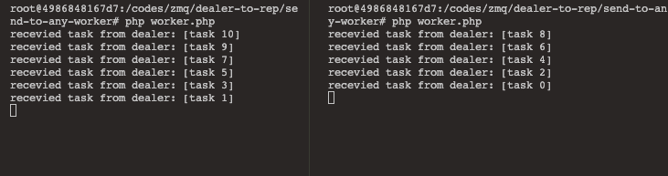

# dealer to REP

similar to REQ->ROUTER, but REQ socket always sends an empty delimiter frame before any data frames; the DEALER does not.

so there are two examples, 
- send task to specific worker
- send to any worker

the issue with this model, is the tasks are not 100% evenly distributed

one worker always takes a bit more than others, DON'T know why.

I think that might be the reason need load balancing

