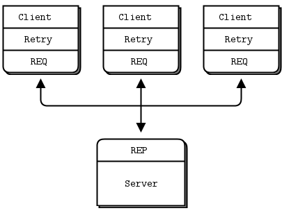
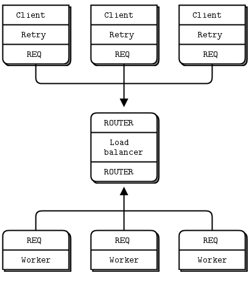
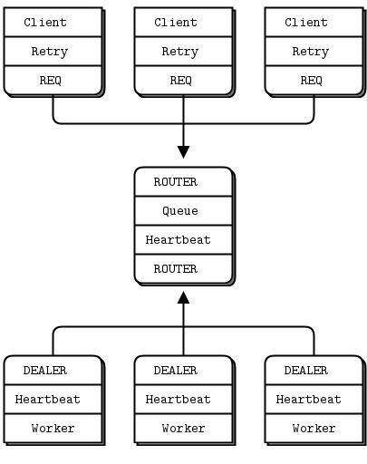

# reliable request reply patterns
in this chapter, we focus heavily on user-space request-reply patterns, reusable models that help you design your own zmq architectures:
- the `lazy pirate` pattern: reliable request-reply from the client side
- the `simple pirate` pattern: reliable request-reply using load balancing
- the `paranoid pirate` pattern: reliable request-reply with heatbeating
- the `Majordomo` pattern: service-oriented reliable queuing
- the `titanic` pattern: disk-based/disconnected reliable queuing
- the `binary star` pattern: primary-backup server failover
- the `freelance` pattern: brokerless reliable request-reply

## what is `reliability`
most people who speak of "reliability" don't really know what they mean. we can only define reliability in terms of failure. that is, if we can handle a certain set of well-defined and understood failures, then we are reliable with respect to those failures. no more, no less. so let's look at the possible causes of failure in a distributed zmq application, in roughly descending order of probability:
- application code is the worst offender. it can crash and exit, freeze and stop responding to input, run too slowly for its input, exhaust all memory and so on
- system code such as brokers we write using zmq can die for the same reason as application code. system code should be more reliable than application code, but it can still crash and burn, and especially run out of memory if it tries to queue messages for slow clients.
- message queues can overflow, typically in system code that has learned to deal brutally with slow clients. when a queue overflows, it starts to discard messages. so we get lost messages
- networks can fail(e.g., wifi gets switched off or goes out of range). zmq will automatically reconnect in such cases, but in the meantime, messages may get lost.
- hardware can fail and take with it all the processes running on that box.
- networks can fail in exotic ways, e.g., some ports on a switch may die and those parts of the network become inaccessible.
- entire data centers can be struck by lightning, earthquakes, fire or more mundane power or cooling failures.

## designing reliability
so to make things brutally simple, reliability is "keeping things working properly when code freezes or crashes", a situation we'll shorten to "dies". however, the things we want to keep working properly are more complex than just messages. we need to take each core zmq messaging pattern and see how  to make it work even when code dies.

let's take them one-by-one:
- `request-reply`: if the server dies(while processing a request), the client can figure that out because it won't get an answer back. then it can give up in a huff, wait and try again later, find another server, and so on. as for the client dying, we can brush that off as someone else's problem for now
- `pub-sub`: if the client dies(having gotten some data), the server doesn't know about it. pub-sub doesn't send any information back from client to server. but the client can contact the server out-of-band. e.g., request-reply and ask "please resend everything I missed". as for the server dying, that's our of scope for here. subscribers can also self-verify that they're not running too slowly, and take action(e.g., warn the operator and die) if they are.
- `pipeline`: if a worker dies(while working), the ventilator doesn't know about it. pipelines, like the grinding gears of time, only work in one direction. but the downstream collector can detect that one task didn't get done, and send a message back to the ventilator saying, "Hey, resend task 324", if the ventilator or collector dies, whatever upstream client originally sent the work batch can get tried of waiting and resend the whole lot. it's not elegant, but the system code should really not die often enough to matter.

in this chapter we'll focus just on request-reply, which is the low-hanging fruit of reliable messaging.

the basic request-reply pattern(a REQ client socket doing a blocking send/receive to a REP server) scores low on handling the most common types of failure. if the server crashes while processing the request, the client just hangs forever, if the network loses the request or the reply, the client hangs forever

request-reply is still much better than TCP, thanks to zmq's ability to reconnect peers silently, to load balance messages, and so on. but it's still not good enough for real work. the only case where you can really trust the basic request-reply pattern is between two threads in the same process where there's no network or separate server process to die.

however, with a little extra work, this humble pattern becomes a good basis for real work across a distributed network, and we get a set of reliable request-reply (RRR) patterns that I like to call the `pirate` patterns( you'll eventually get the joke, i hope).

there are, in  my experience, roughly three ways to connect clients to servers. each needs a specific approach to reliability:

- multiple clients talking directly to a single server. uses cases: a single well-known server to which clients need to talk. types of failure we aim to handle: server crashes and restarts and network disconnects.

- multiple client talking to a broker proxy that distributes work to multiple workers. use cases: service-oriented transaction processing. types of failure we aim to handle: worker crashes and restarts, worker busy lopping, worker overload, queue creases and restarts and network disconnects.

- multiple clients talking to multiple servers with no intermediary proxies. use case: distributed services such as name resolution. types of failure we aim to handle: service creashes and restarts, service busy looping, service overload, and network disconnects.

each of these approaches has its trade-offs and often you'll mix them. we'll look at all three in detials


## client-side reliability(lazy pirate pattern)

we can get very simple reliable request-reply with some changes to the client. we call this the lazy pirate pattern, rather than doing a blocking receive, we:
- poll the req socket and receive from it only when it's sure a reply ahs arrived
- resend a request, if no reply has arrived whin a timeout period
- abandon the transaction if there is still no reply after several requests.

if you try to use REQ socket in anything other than a strict send/receive fashion, you'll get an error(technically, the REQ socket implements a small finite-state machine to enforce the send/receive ping-pong, and so the error code is called "EFSM"), this is slightly annoying when we want to use REQ in a pirate pattern, because we may send several request before getting a reply.

the pretty good brute force solution is to close and repon the REQ socket after an error:

`lazy_pirate_client.php`  `lazy_pirate_server.php`

### the lazy pirate pattern


to run this test case, start the client and the server in two console windows, the server wil randomly misbehave after a few messages. you can check the client's response.here is typical output from the server.
```bash
I: normal request (1)
I: normal request (2)
I: normal request (3)
I: simulating CPU overload
I: normal request (4)
I: simulating a crash
And here is the client’s response:

I: connecting to server...
I: server replied OK (1)
I: server replied OK (2)
I: server replied OK (3)
W: no response from server, retrying...
I: connecting to server...
W: no response from server, retrying...
I: connecting to server...
E: server seems to be offline, abandoning
```

the client sequences each message and checks that replies come back exactly in order: that no requests or replies are lost, and no replies come back more than once, or out of order. run the test a few times until you're convinced that this mechanism actually works. you don't need sequence numbers in a production application; they just help use trust our design.

the client uses a REQ socket, and does the brute force close/reopen because REQ sockets impose that strict send/receive cycle. you might be tempted to use a dealer instead, but it would not be a good decision. 
First, it would mean emulating the secret sauce that REQ deos with envelops(if you've forgotten what that is, it's a good sign you don't want oto have to do it). second, it would mean potentially getting back replies that you didn't expect. 

handling failures only at the client works when we have a set of clients talking to a single server. it can handle a server crash, but only if recovery means restarting tyhat same server. if there's a permanent error, such as a dead power supply on the server hardware, this approach won't work. because the application code in servers is usually the biggest source of failures in any architecture, depending on a single server is not a great idea.

so pros and cons:
- Pro: simple to understand and implement
- pro: works easily with existing client and server application code.
- Pro: zmq automatically retries the actual reconnection until it works
- con: doesn't failover to backup or alternate servers.

## basic reliable queuing (simple Pirate pattern)
our second approach extends the Lazy Pirate pattern with a queue proxy that lets us talk, transparently, to multiple servers, which we can more accurately call "workers". we'll develop this in stages, we starting with a minimal working model, the simple pirate pattern.


in all these pirate patterns, workers are stateless. if the application requires some shared state, such as a shared database, we don't know about it as we design our messaging framework. having a queue proxy means workers can come and go without clients knowing anything about it. if one worker dies, another takes over. this is a nice, simple topology with only one real weakness, namely the central queue itself, which can become a problem to manage, and a single point of failure.

### the simple pirate pattern


the basis for the queue proxy is the load balancing broker from Advanced request-reply patterns. what is the very minimum we need to do to handle dead or blocked workers? turns out, it's surprisingly little. we already have a retry mechanism in the client. so using the load balancing pattern will work pretty well. this fits with zmq philosophy that we can extend a peer-to-peer pattern like request-reply by plugging naive proxies in the middle.

we don't need a special client, we're still using the lazy pirate client. here is the queue, which is identical to the main task of the load balancing broker;

`simple_pirate_queue.php`
`simple_pirate_worker.php`

to test this, start a handful of workers, a lazy pirate client, and the queue, in any order. you'll see that the workers eventually all crash and burn, and the client retries and then give up. the queue never stops, and you can restart workers and clients. this model works with any number of clients and workers.


## Robust Reliable Queuing (Paranoid Pirate Pattern)



the simple pirate queue pattern works pretty well, especially because it's just a combination of two existing patterns. still, it does have some weaknesses:
- it's not robust in the face of a queue crash and restart. the client will recover, but the worker won't while zmq will reconnect workers sockets automatically, as far as the newly started queue is concerned, the workers haven't signaled ready, so don't exist. to fix this we have to do heartbeating from queue to worker so that the worker can detect when the queue has gone away
- the queue does not detect worker failure, so if a worker dies while idle, the queue can't remove it from its worker queue until the queue sends it a request. the client waits and retries for nothing. it's not a critical problem, but it's not nice. to make this work properly, we do heartbeating from worker to queue, so that the queue can detect a lost worker at any stage.

we'll fix these in a properly pedantic paranoid pirate pattern.

https://zguide.zeromq.org/docs/chapter4/