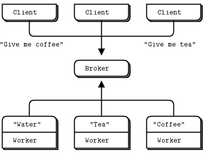

# reliable request reply patterns
in this chapter, we focus heavily on user-space request-reply patterns, reusable models that help you design your own zmq architectures:
- the `lazy pirate` pattern: reliable request-reply from the client side
- the `simple pirate` pattern: reliable request-reply using load balancing
- the `paranoid pirate` pattern: reliable request-reply with heatbeating
- the `Majordomo` pattern: service-oriented reliable queuing
- the `titanic` pattern: disk-based/disconnected reliable queuing
- the `binary star` pattern: primary-backup server failover
- the `freelance` pattern: brokerless reliable request-reply

## what is `reliability`
most people who speak of "reliability" don't really know what they mean. we can only define reliability in terms of failure. that is, if we can handle a certain set of well-defined and understood failures, then we are reliable with respect to those failures. no more, no less. so let's look at the possible causes of failure in a distributed zmq application, in roughly descending order of probability:
- application code is the worst offender. it can crash and exit, freeze and stop responding to input, run too slowly for its input, exhaust all memory and so on
- system code such as brokers we write using zmq can die for the same reason as application code. system code should be more reliable than application code, but it can still crash and burn, and especially run out of memory if it tries to queue messages for slow clients.
- message queues can overflow, typically in system code that has learned to deal brutally with slow clients. when a queue overflows, it starts to discard messages. so we get lost messages
- networks can fail(e.g., wifi gets switched off or goes out of range). zmq will automatically reconnect in such cases, but in the meantime, messages may get lost.
- hardware can fail and take with it all the processes running on that box.
- networks can fail in exotic ways, e.g., some ports on a switch may die and those parts of the network become inaccessible.
- entire data centers can be struck by lightning, earthquakes, fire or more mundane power or cooling failures.

## designing reliability
so to make things brutally simple, reliability is "keeping things working properly when code freezes or crashes", a situation we'll shorten to "dies". however, the things we want to keep working properly are more complex than just messages. we need to take each core zmq messaging pattern and see how  to make it work even when code dies.

let's take them one-by-one:
- `request-reply`: if the server dies(while processing a request), the client can figure that out because it won't get an answer back. then it can give up in a huff, wait and try again later, find another server, and so on. as for the client dying, we can brush that off as someone else's problem for now
- `pub-sub`: if the client dies(having gotten some data), the server doesn't know about it. pub-sub doesn't send any information back from client to server. but the client can contact the server out-of-band. e.g., request-reply and ask "please resend everything I missed". as for the server dying, that's our of scope for here. subscribers can also self-verify that they're not running too slowly, and take action(e.g., warn the operator and die) if they are.
- `pipeline`: if a worker dies(while working), the ventilator doesn't know about it. pipelines, like the grinding gears of time, only work in one direction. but the downstream collector can detect that one task didn't get done, and send a message back to the ventilator saying, "Hey, resend task 324", if the ventilator or collector dies, whatever upstream client originally sent the work batch can get tried of waiting and resend the whole lot. it's not elegant, but the system code should really not die often enough to matter.

in this chapter we'll focus just on request-reply, which is the low-hanging fruit of reliable messaging.

the basic request-reply pattern(a REQ client socket doing a blocking send/receive to a REP server) scores low on handling the most common types of failure. if the server crashes while processing the request, the client just hangs forever, if the network loses the request or the reply, the client hangs forever

request-reply is still much better than TCP, thanks to zmq's ability to reconnect peers silently, to load balance messages, and so on. but it's still not good enough for real work. the only case where you can really trust the basic request-reply pattern is between two threads in the same process where there's no network or separate server process to die.

however, with a little extra work, this humble pattern becomes a good basis for real work across a distributed network, and we get a set of reliable request-reply (RRR) patterns that I like to call the `pirate` patterns( you'll eventually get the joke, i hope).

there are, in  my experience, roughly three ways to connect clients to servers. each needs a specific approach to reliability:

- multiple clients talking directly to a single server. uses cases: a single well-known server to which clients need to talk. types of failure we aim to handle: server crashes and restarts and network disconnects.

- multiple client talking to a broker proxy that distributes work to multiple workers. use cases: service-oriented transaction processing. types of failure we aim to handle: worker crashes and restarts, worker busy lopping, worker overload, queue creases and restarts and network disconnects.

- multiple clients talking to multiple servers with no intermediary proxies. use case: distributed services such as name resolution. types of failure we aim to handle: service creashes and restarts, service busy looping, service overload, and network disconnects.

each of these approaches has its trade-offs and often you'll mix them. we'll look at all three in detials


## client-side reliability(lazy pirate pattern)

we can get very simple reliable request-reply with some changes to the client. we call this the lazy pirate pattern, rather than doing a blocking receive, we:
- poll the req socket and receive from it only when it's sure a reply ahs arrived
- resend a request, if no reply has arrived whin a timeout period
- abandon the transaction if there is still no reply after several requests.

if you try to use REQ socket in anything other than a strict send/receive fashion, you'll get an error(technically, the REQ socket implements a small finite-state machine to enforce the send/receive ping-pong, and so the error code is called "EFSM"), this is slightly annoying when we want to use REQ in a pirate pattern, because we may send several request before getting a reply.

the pretty good brute force solution is to close and repon the REQ socket after an error:

`lazy_pirate_client.php`  `lazy_pirate_server.php`

### the lazy pirate pattern


to run this test case, start the client and the server in two console windows, the server wil randomly misbehave after a few messages. you can check the client's response.here is typical output from the server.
```bash
I: normal request (1)
I: normal request (2)
I: normal request (3)
I: simulating CPU overload
I: normal request (4)
I: simulating a crash
And here is the client’s response:

I: connecting to server...
I: server replied OK (1)
I: server replied OK (2)
I: server replied OK (3)
W: no response from server, retrying...
I: connecting to server...
W: no response from server, retrying...
I: connecting to server...
E: server seems to be offline, abandoning
```

the client sequences each message and checks that replies come back exactly in order: that no requests or replies are lost, and no replies come back more than once, or out of order. run the test a few times until you're convinced that this mechanism actually works. you don't need sequence numbers in a production application; they just help use trust our design.

the client uses a REQ socket, and does the brute force close/reopen because REQ sockets impose that strict send/receive cycle. you might be tempted to use a dealer instead, but it would not be a good decision. 
First, it would mean emulating the secret sauce that REQ deos with envelops(if you've forgotten what that is, it's a good sign you don't want oto have to do it). second, it would mean potentially getting back replies that you didn't expect. 

handling failures only at the client works when we have a set of clients talking to a single server. it can handle a server crash, but only if recovery means restarting tyhat same server. if there's a permanent error, such as a dead power supply on the server hardware, this approach won't work. because the application code in servers is usually the biggest source of failures in any architecture, depending on a single server is not a great idea.

so pros and cons:
- Pro: simple to understand and implement
- pro: works easily with existing client and server application code.
- Pro: zmq automatically retries the actual reconnection until it works
- con: doesn't failover to backup or alternate servers.

## basic reliable queuing (simple Pirate pattern)
our second approach extends the Lazy Pirate pattern with a queue proxy that lets us talk, transparently, to multiple servers, which we can more accurately call "workers". we'll develop this in stages, we starting with a minimal working model, the simple pirate pattern.


in all these pirate patterns, workers are stateless. if the application requires some shared state, such as a shared database, we don't know about it as we design our messaging framework. having a queue proxy means workers can come and go without clients knowing anything about it. if one worker dies, another takes over. this is a nice, simple topology with only one real weakness, namely the central queue itself, which can become a problem to manage, and a single point of failure.

### the simple pirate pattern


the basis for the queue proxy is the load balancing broker from Advanced request-reply patterns. what is the very minimum we need to do to handle dead or blocked workers? turns out, it's surprisingly little. we already have a retry mechanism in the client. so using the load balancing pattern will work pretty well. this fits with zmq philosophy that we can extend a peer-to-peer pattern like request-reply by plugging naive proxies in the middle.

we don't need a special client, we're still using the lazy pirate client. here is the queue, which is identical to the main task of the load balancing broker;

`simple_pirate_queue.php`
`simple_pirate_worker.php`

to test this, start a handful of workers, a lazy pirate client, and the queue, in any order. you'll see that the workers eventually all crash and burn, and the client retries and then give up. the queue never stops, and you can restart workers and clients. this model works with any number of clients and workers.


## Robust Reliable Queuing (Paranoid Pirate Pattern)


the simple pirate queue pattern works pretty well, especially because it's just a combination of two existing patterns. still, it does have some weaknesses:
- it's not robust in the face of a queue crash and restart. the client will recover, but the worker won't while zmq will reconnect workers sockets automatically, as far as the newly started queue is concerned, the workers haven't signaled ready, so don't exist. to fix this we have to do heartbeating from queue to worker so that the worker can detect when the queue has gone away
- the queue does not detect worker failure, so if a worker dies while idle, the queue can't remove it from its worker queue until the queue sends it a request. the client waits and retries for nothing. it's not a critical problem, but it's not nice. to make this work properly, we do heartbeating from worker to queue, so that the queue can detect a lost worker at any stage.

we'll fix these in a properly pedantic paranoid pirate pattern.

we previously used a REQ socket for the worker. for the paranoid pirate worker, we'll switch to a DEALER socket. this has the advantage of letting us send and receive messages at any time. rather than the lock-stop send/receive that REQ imposes. the downside of DEALER is that we have to do our own envelope management

we're still using the lazy pirate client, here is the paranoid priate queue proxy:

`paranoid_pirate_queue.php`

the queue extends the load balancing pattern with heartbeating of workers. heartbeating is one of those "simple" things that can be difficult to get right. 

`paranoid_pirate_worker.php`


some comments about this example
- the code includes simulation of failures, as before. this makes it (a) very hard to debug, (b) dangerous to reuse. when you want to debug this, disable the failure simulation
- the worker uses a reconnect strategy similar to the one we designed for the Lazy Pirate client, with two major differences: (a) it does an exponential back-off, and (b) it retries indefinitely (whereas the client retries a few times before reporting a failure).

try the client, queue, and workers, such as by using a script like this:
```bash
paranoid_pirate_queue.php

for i in 1 2 3 4; do
    paranoid_pirate_worker.php
    sleep 1
done
lazy_pirate_client.php
```

you should see the workers die one-by-one as they simulate a crash, and the client eventually give up. you can stop and restart the queue and both client and workers will reconnect and carry on. and no matter what you do to queues and workers, the client will never get an out-of-order reply: the whole chain either works, or the client abandons.

## Heartbeating
heartbeating solves the problem of knowing whether a peer is alive or dead. this is not an issue specific to zmq, TCP has a long timeout (30 minutes or so), that means that it can be impossible to know whether a peer has died, been disconnected, or gone on  a weekend to Prague with a case of vodka, a readhead, and a large expense account.

it's not easy to get heartbeating right. when writing the paranoid pirate examples, it took about five hours to get the heartbeating working properly. the rest of the request-reply chain took perhaps then minutes. it is especially easy to create "false failures", i.e., when peers decided that they are disconnected because the heartbeats aren't sent properly.

we'll look at the three main answers people use for heartbeating with zmq.

### Shrugging it off
the most common approach is to do no heartbeating at all and hope for the best. may if not most zmq applications do this.  zmq encourages this by hiding peers in many cases. what problems does this approach cause?
- when we use a ROUTER socket in an application that tracks peers, as peers disconnect and reconnect, the application will leak memory(resources that the application holds for each peer) and get slower and slower
- when we use SUB- or DEALER- based data recipients, we can't tell the difference between good silence(there's no data) and bad silence(the other end died). when a recipient knows the other side died, it can for example switch over to a backup route.
- if we use a TCP connection that stays silent for a long while, it will, in some networks, just die. sending something(technically, a keep-alive more than a heartbeat), will keep the network alive.

### one way heartbeats
a second option  is to send a heartbeat message from each node to its peers every second or so. when one node hears nothing from another within some timeout(several seconds, typically), it will treat that peer as dead. sounds good, right? sadly, no. this works in some cases but has nasty edge cases in others.

for pub-sub, this does work, and it's the only model you can use. SUB sockets can not talk back to PUB sockets, but PUB sockets can happily send "i'm alive" message to their subscribers.

as an optimization, you can send heartbeats only when there is no real data to send. furthermore, you can send heartbeats progressively slower and slower, if network activity is an issue(e.g., on mobile networks where activity drains the battery). as long as the recipient can detect a failure(sharp stop in activity), that't fine.

here are the typical problem with this design:
- it can be inaccurate when we send large amounts of data, was heartbeats will be delayed behind that data. if heartbeats are delayed, you can get false timeout and disconnections due to network congestion. thus, always treat any incoming data as a heartbeat, whether or not the sender optimizes out heartbeats
- while the pub-sub pattern will drop messages for disappeared recipients, PUSH and DEALER sockets will queue them. so if you send heartbeats to a dead peer and it comes back, it will get all the heartbeats you sent, which can be thousands.
- this design assume that heartbeat timeouts are the same across thw whole network. but that won't be accurate. some peers will want every aggressive heartbeating in order to detect faults rapidly. and some will want very relaxed heartbeating, in order to let sleeping networks lie and save power.

### Ping-Pong heartbeats
the third option is to use a ping-pong dialog. one peer sends a ping command to the other, which replies with a pong command. neither command ahs any payload. pings and pongs are not correlated. because the roles of "client" and "server" are arbitrary in some networks, we usually specify that either peer can in fact send a ping and expect a pong in response. however, because the timeouts depend on network topologies known best to dynamic clients, it is usually the client that pings the server.

this works for all ROUTER-based brokers. the same optimizations we used in the second model make this work even better: treat any incoming data as a pong, and only send  a ping when not otherwise sending data.

### heartbeating for paranoid pirate

for paranoid pirate, we chose the second approach. it might not have been the simplest option: if designing this today. i'd probably try a ping-pong approach instead. however the principles are similar. the heartbeat messages flow asynchronously in both directions, and either peer can decide the other is "dead" and stop talking to it.

in the worker, this is how we handle heartbeats from the queue
- we calculate a liveness, which is how many heartbeats we can still misss before deciding the queue is dead. it starts at three and we decrement it each time we miss a heartbeat.
- we wait, in the zmq_poll loop, for one second each time, which is our heartbeat interval.
- if there's any message from the queue during that time, we reset our liveness to three.
- if there's no message during that time, we count down our livenes.
- if the liveness reaches zero, we consider the queue dead.
- if the queue is dead, we destory our socket, create a new one, and reconnect.
- to avoid opening and closing too many socktes, we wait for a certain interval before reconnecting, and we double the interval each time until it reaches 32 seconds

and this is how we handle heartbeats to the queue:
- we calculate when to send the next heartbeat; this is a single variable because we're talking to one peer, the queue
- in the zmq_poll loop, whenever we pass this time, we send a heartbeat to the queue

here's the essential heartbeating code for the worker:

```c
#define HEARTBEAT_LIVENESS 3    // 3-5 is reasonable
#define HEARTBEAT_INTERVAL 1000 // msecs
#define INTERVAL_INIT   1000    //initial reconnect
#define INTERVAL_MAX    32000   // after exponential backoff

// if liveness hits zero, queue is considered disconnected
size_t liveness = HEARTBEAT_LIVENESS;
size_t interval = INTERVAL_INIT;

// send out heartbeats at regular intervals
uint64_t heartbeat_at = zclock_time() + HEARTBEAT_INTERVAL;
while(true) {
    zmq_pollitem_t items [] = {{ worker, 0, ZMQ_POLLIN, 0}};
    int rc = zmq_poll (items, 1, HEARTBEAT_INTERVAL * ZMQ_POLL_MESC);

    if (items [0].revents & ZMQ_POLLIN) {
        // receive any message from queue
        liveness = HEATBEAT_LIVENESS;
        interval = INTERVAL_INIT;
    } else {
        if(--liveness == 0){
            zclock_sleep(interval);

            if(interval < INTERVAL_MAX){
                interval *=2;
            }
            zsocket_destory(ctx, worker);
            ...
            liveness = HEARTBEAT_LIVENESS;
        }
        // send heartbeat to queue if it's time
        if(zclock_time() > heartbeat_at){
            heartbeat_at = zclock_time() + HEARTBEAT_INTERVAL;
            // send hearbeat message to queue
        }
    }
}
```
the queue does the same, but manages an expiration time for each worker.
here are some tips for your won heartbeating implementation:
- use zmq_poll or a reactor as the core of your application's main task
- start by building the heartbeating between peers, test it by simulating failures, and then build the rest of the mesage flow. adding heartbeating afterwards in much trickier
- use simple tracing, i.e., print to console, to get this working. to help you trace the flow of messages between peers, use a dump method such as zmsg offers, and number your messages incrementally so you can see if there are gaps.
- in a real application, heartbeating must be configurable and usually negotiated with the peer, some peers will want aggressive heartbeating, as low as 10  msecs. other peers will be far away and want heartbeating as hight as 30 seconds.
- if you have different heatbeat intervals for different peers, you poll timeout should be the lowest(shortest time) of these. do not use an infinite timeout
- do heartbeating on the same socket you sue for messages, so your heartbeats also act as a keep-alive to stop the network connection from going stale(some firewalls can be unkind to silent connections).

### contracts and protocols
if you are paying attention, you'll realize that paranoid pirate is not interoperable with simple pirate, because of the heartbeats. but how do we define "interoperable"? to guarantee interoperability, we need a kind of contract, an agreement that lets different teams in different times and places write code that is guaranteed to work together. we call this a "protocol".

it's fun to experiment without specifications, but that's not a sensible basis for real applications. what happens if we want to write a worker in another language? do we have to read code to see how things work? what if we want to change the protocol for some reason? even a simple protocol will, if ti's successful, evolve and become more complex.

lack of contract is a sure sign of a disposable application. so let's write a contract for this protocol. how do we do that?

there's a wiki at rfc.zeromq.org that we made especially as a home for public zmq contracts. to create a new specification, register on the wiki if needed, and the follow the instructions. it's fairly straightforward, though writing technical texts is not everyone's cup of tea.

it took me about fifteen minutes to draft the pirate pattern protocol. it's not a big specification, but it does capture enough to act as the basis for arguments("you queue isn't PPP compatible, please fit it!")

turning PPP into a real protocol would take more work:
- there should be a protocol version number in the READY command so that  it's possible to distinguish between different versions of PPP

- right now, READY and HEARTBEAT are not entirely distinct from requests and replies. to make them distinct, we would need a message structure that includes a message type part.

### service-oriented reliable queuing (Majordomo pattern)


the nice thing about progress is how fast it happens when lawyers and committees aren't involved. the one-page MDP specification turns PPP into something more solid. this is how we should design complex architectures: start by writing down the contracts and only then write software to implement them.

the Majordomo protocol (MDP) extends and improves on PPP in one interesting way: it adds a "service name" to requests that the client sends and asks workers to register for specific services. adding service names turns our paranoid pirate queue into a service-oriented broker. the nice thing about MDP is that it came out of working code, a simple ancestor protocol(PPP), and a precise set of improvements that each solved a clear problem. this make it easy to draft. 

to implement Majordomo, we need to write a framework for clients and workers. ti's really not sane to ask every application developer to read the spec and make it work, when they could be using a simpler API that does the work for them.

so while our first contact(MDP itself) defines how the pieces of our distributed architecture talk to each other, our second contract defines how user applications talk to the technical framework we're going to design.

Majordomo has tow halves, a client side and a worker side. because we'll wirte both client and worker applications, we will need two APIs. here is a sketch for the client API, using a simple object-oriented approach:

```c
mdcli_t     *mdcli_new      (char *broker);
void        mdwrk_destory   (mdwrk_t **self_p);
zmsg_t      *mdwrk_recv     (mdwrk_t *self, zmsg_t *reply);
```
that's it, we open a session to the broker, send a request message, get a reply message back, and eventually close the connection. 
here's a sketch for the worker API:
```c
mdwrk_t     *mdwrk_new      (char *broker, char *service);
void        mdwrk_destroy   (mdwrk_t **self_p);
zmsg_t      *mdwrk_recv     (mdwrk_t *self, zmsg_t *reply);
```
it's more or less symmetrical, but the worker dialog is a little different. the first time a worker does a recv(), it passes a null reply. thereafter, it passes the current reply, and gets a new request.

the client and worker APIs were fairly simple to construct because the're heavily based on the paranoid pirate code we already developed. here is the client API:
`majordomo_client_api.php`

let's see how the client API looks in action, with an example test program that does 100K request-reply cycles:
`majordomo_client_application.php`

and here is the worker API
`majordomo_worker_api.php`

https://zguide.zeromq.org/docs/chapter4/

php zmq repo: https://github.com/booksbyus/zguide/blob/master/examples/PHP/mdp.php